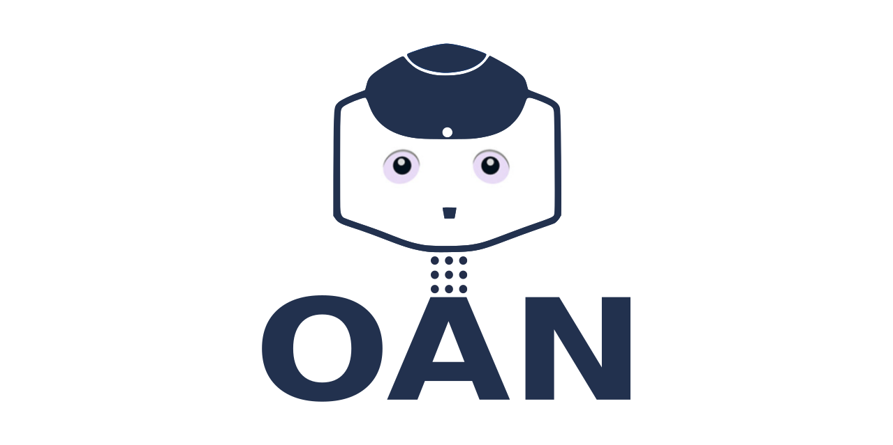
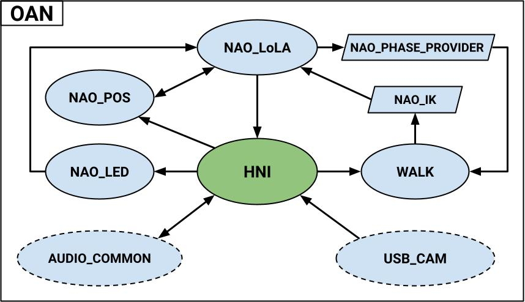

# Open Access NAO (OAN)

Open Access NAO (OAN) is a *ROS2-based software framework for HRI applications with the NAO robot*.

## Description

Embracing the common demand of researchers for better performance and new features for NAO, the authors took advantage of the ability to **run ROS2 onboard on the NAO** to develop a framework independent of the APIs maintained by the manufacturer. 

### Main features

Our system provides NAO with not only the basic skills of a humanoid robot such as walking and reproducing movements of interest but also features often used in HRI such as: 

 - *Speech recognition/synthesis* via Google Cloud Platform.
 - *Face and object recognition* via YOLOv8.
 - use of *Generative Pre-trained Transformer (GPT) model for conversation* thanks to ChatGPT. 

The developed code is therefore configured as a ready-to-use but also highly expandable and improvable tool thanks to the possibilities provided by the ROS community.

### Modules

This repository collects all the code on which OAN is based. The following image provides an overview of the different parts and the flow of information.

Parallelograms and ellipses are ROS packages and modules (a collection of packages), respectively. 
Dashed lines shows parts developed by the ROS community.

For a detailed description of each module please look at the related paper: [Open Access NAO (OAN): a ROS2-based software framework for HRI applications with the NAO robot](https://arxiv.org/abs/2403.13960)

## Build the framework

If you have never used [vcstool](https://github.com/dirk-thomas/vcstool), install it. The easyiest way is via pip

    sudo pip install vcstool

In order to help the organization of your code we suggest to create a new ROS2 workspace

    mkdir -p oan_ws/src
    cd oan_ws

Clone the OAN repository

    git clone https://github.com/antbono/OAN.git

Import all the needed packages via vcstool

    vcs import src <  OAN/oan.repos

Build the packages

    colcon build

 

## Installation on the NAO

In order to run the provided software on a real NAO v6 you need to install the custom Ubuntu OS and a version of ROS2.

### Install the custom Ubuntu OS

The first step is to install the Ubuntu 22.04 image created by the [Nao Devils SPL team](https://naodevils.de/). Instructions are listed in naov6_flash.md.

### Install ROS2 on NAO

At the moment, we suggest the [Rolling release](https://docs.ros.org/en/rolling/index.html#) because most of the modules are tested on it.

Follow the [ROS2 official guide](https://docs.ros.org/en/rolling/Installation/Ubuntu-Install-Debians.html) to install the binary packages for Ubuntu. 
Please be careful and use the ROS-Base Install (Bare Bones), since the installed Ubuntu does't have a GUI.

### Install OAN

Use the [sync](https://github.com/ijnek/sync/tree/main) script to send the packages you built on your pc to NAO. This avoids building the packages on NAO which requires a lot of time.

